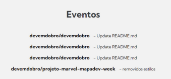
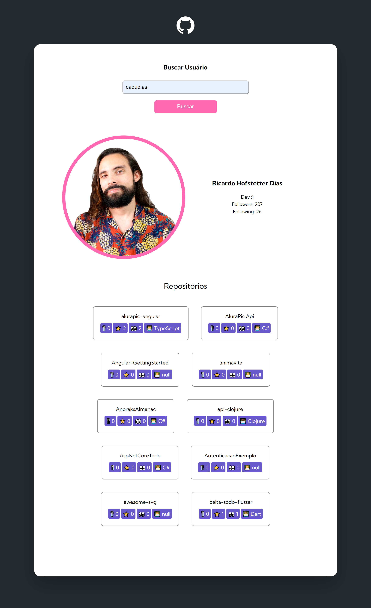

# | 🧙‍♂️ Quest 🏹🐲 | JavaScript Avançado

## Sobre o Desafio 🔭

Solicitação 1

O seu gerente de projetos veio com uma nova solicitação para ser acrescentada no projeto que busca as informações do usuário do GitHub.

- Agora além de trazer:
    - Imagem do usuário
    - Nome completo do usuário
    - Login do usuário
    - Bio do usuário
- Você precisa mostrar também:
    - Número de seguidores do usuário
    - Número de pessoas que o usuário está seguindo

Solicitação 2

O seu gerente de projetos veio com uma nova solicitação para ser acrescentada no projeto. Agora ele quer apresentar as informações dos últimos eventos do usuário no GitHub.

A solicitação é a seguinte:

- Você deve apresentar na tela uma lista com até 10 últimos eventos do usuário no GitHub. Os eventos que serão apresentados são de dois tipos: CreateEvent e PushEvent apenas.
- Para buscar os eventos você pode usar esse endpoint do GitHub: (https://api.github.com/users/_coloque-onome-do-usuario-aqui_/events, por exemplo https://api.github.com/users/devemdobro/events): Para cada atividade do tipo PushEvent você deve mostrar o nome do repositório e a mensagem de commit do Evento. Exemplo:

- Se for uma atividade do tipo CreateEvent você deve mostrar apenas a mensagem “Sem mensagem de commit”

Solicitação 3

O seu gerente de projetos veio com com uma nova solicitação para ser acrescentada no projeto que busca as informações dos repositórios do usuário do GitHub.

- Agora além de trazer:
    - Nome do repositório
    - Link do repositório
- Você precisa mostrar também:
    - Quantidade de forks do repositório
    - Quantidade de estrelas do repositório
    - Quantidade de watchers do repositório
    - Mostrar a linguagem de programação do repositório

### Screenshots 🎴

#### Solução

Link da página: [Site](https://ramon-alvez.github.io/Quest-JS-Avancado/)

## Autor 🧙‍♂️

- GitHub: [Ramon Alvez](https://github.com/Ramon-Alvez)
- LinkedIn: [@Ramon Alvez](www.linkedin.com/in/ramon-alvez)
