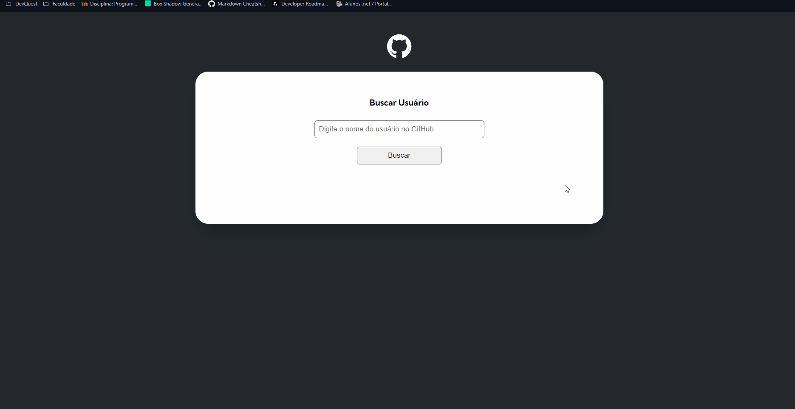
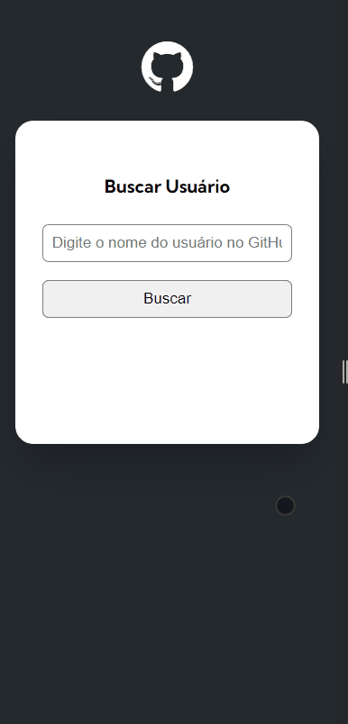

# DevQuest| Projeto Fetch - GitHub API 

## Sobre o Projeto 🔭

Neste módulo do curso DevQuest foi apresentado como criar um projeto que consome a API do GitHub usando o fetch para buscar informações dos usuários e mostrar na tela, os objetivos foram:

- Por em prática os conhecimentos de Fetch e APIs;
- Aprender como funciona um projeto real, suas estruturas e a como subir isso no github de forma correta;

Tanto o modelo quanto as demais estruturas foram fornecidas e explicadas pelos gêmeos nesse módulo do curso

### Screenshots 🎴

#### Desktop

#### Mobile

### Links

Link da página: [Site](https://ramon-alvez.github.io/DevQuest-projeto-inicial-fetch-github-api/)

## O que aprendi 📚

Nesse módulo explicativo de "criando um projeto real com fetch" eu pude ver como é criado e organizado um projeto, aprendi mais sobre estruturação de pastas, requisições de exportação e importação e também sobre como funcionam os links embedados no github (links absolutos e relativos). 

## Autor 🧙‍♂️

### Aluno (Eu) 😃

- GitHub: [Ramon Alvez](https://github.com/Ramon-Alvez/Frontend-Mentor-HTML-CSS-Intermediate-ChatApp-CSS-illustration)
- LinkedIn: [@Ramon Alvez](https://github.com/Ramon-Alvez/Frontend-Mentor-HTML-CSS-Intermediate-ChatApp-CSS-illustration)

### Professores 🧙‍♂️

- LinkedIn Curso: [@Dev em Dobro](https://www.linkedin.com/company/dev-em-dobro/posts/?feedView=all)
- LinkedIn Roberto: [@Roberto Dias](https://www.linkedin.com/in/robertorhd/)
- LinkedIn Ricardo: [@Ricardo Dias](https://www.linkedin.com/in/ricardohdias/)